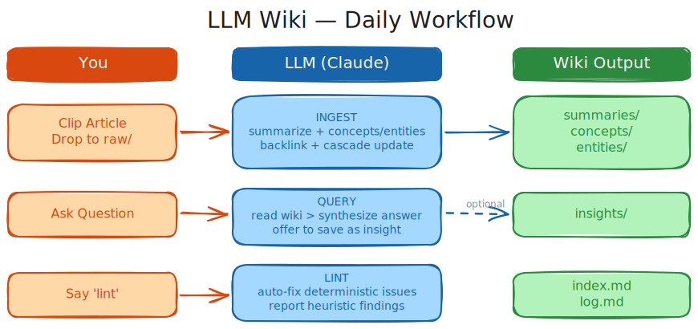

# llm-wiki

<p align="center">
  <br />
  <sub>LLM-powered personal knowledge base</sub>
</p>

An LLM wiki that evolves with you. Based on [Karpathy's LLM Wiki](https://gist.github.com/karpathy/442a6bf555914893e9891c11519de94f).

This repo ships two things:

| What | Path | Purpose |
|------|------|---------|
| **Skill** | `skills/llm-wiki/` | Agent skill (Claude Code / Cursor / Copilot) — INIT, INGEST, QUERY, UPDATE, LINT |
| **CLI** | `lwiki/` | Python CLI — scaffold wiki trees and track `raw/` drift |

## Quick Start

You can do the manual installation without needing `uv` or `act-cli`.
However, it will be quicker to sync with this repo if you use the manifest file.

### 1. Requirements

- `uv` is installed, get it from [here](https://docs.astral.sh/uv/getting-started/installation/) if it is not.
- Install `act-cli` with:

```bash
uv tool install https://github.com/hsuanguo/act-cli.git
```

### 2. Create an `act.toml`

Add an `act.toml` to your wiki root:

```toml
[project]
name = "my-wiki"
description = "My LLM Wiki"

[skills]
llm-wiki = "hsuanguo/llm-wiki/skills/llm-wiki"

[dependencies.tools.uv]
lwiki = "git+https://github.com/hsuanguo/llm-wiki.git"
```

### 3. Sync

Just do:

```bash
act
```

This installs the `llm-wiki` agent skill and the `lwiki` CLI tool.

## Manual Setup

Install the CLI:

```bash
pip install .
# or with uv:
uv tool install .
```

Copy the skill into your wiki:

```bash
cp -r skills/llm-wiki /path/to/project/.claude/skills/
```

## Skill

The `skills/llm-wiki/` directory is a self-contained agent skill with:

- **`SKILL.md`** — main instructions (gather context, route to operation, execute)
- **`references/`** — per-operation playbooks: `init.md`, `ingest.md`, `query.md`, `update.md`, `lint.md`
- **`templates/`** — starter page templates: `index.md`, `concept.md`, `entity.md`, `insight.md`, `summary.md`

Works with any agent that reads `SKILL.md` from `.claude/skills/` or similar conventions.

`.claude/skills/` is supported by most AI agents (OpenCode, Cursor, etc.). If your agent does not support this location, move it to the path your agent expects.

## Usage

This wiki skill was designed for Obsidian, but it can work with any frontend. The typical workflow can be described as below.

<p align="center">
  <br />
</p>

### 1. Create a New Wiki (INIT)

Tell Agent:

```
Init a wiki at wiki/greek-history for Greek history
```

AI Agent will:
- Run `lwiki init` to create the directory structure
- Generate `AGENTS.md` (domain schema), `CLAUDE.md`, and starter wiki files
- Create empty `raw/`, `assets/`, and wiki subdirectories

**Result:**
```
wiki/greek-history/
├── AGENTS.md           # Your domain schema
├── CLAUDE.md           # Auto-imports AGENTS.md
├── assets/
├── raw/
│   └── files.log
└── wiki/
    ├── index.md
    ├── log.md
    ├── overview.md
    ├── summaries/
    ├── concepts/
    ├── entities/
    └── insights/
```

### 2. Add Sources (INGEST)

#### Option A: Files

Move source files (PDF, Markdown, etc.) into `wiki/greek-history/raw/`

Then tell AI:
```
Ingest all new sources in raw/
```

#### Option B: Paste content directly

```
Add this to the wiki:
<paste article text or URL>
```

#### What happens during ingest

AI will:
1. Read each source in full
2. Create or update pages in `summaries/`, `concepts/`, `entities/`
3. Run a backlink audit — add `[[wikilinks]]` across existing pages
4. Scan the entire wiki for pages affected by the new information (cascade update)
5. Update `index.md`, `overview.md`, and `log.md`
6. Sync `raw/files.log` via `lwiki raw sync`

**Note:** AI Agent proceeds autonomously. It only asks you when something is genuinely unclear (ambiguous facts, conflicting sources it can't resolve).

### 3. Ask Questions (QUERY)

```
What do we know about the Peloponnesian War?
```

```
Compare Athenian and Spartan military strategies across all sources
```

```
What are the unresolved questions about the fall of Mycenaean civilization?
```

AI answers strictly from wiki content, citing pages with `[[wikilinks]]`. After answering, it may:
- **Offer to save** the analysis as an insight page (if the answer has standalone value)
- **Report issues** found in existing pages (outdated info, contradictions) and ask if you want to fix them

### 4. Update Pages (UPDATE)

#### User-triggered (you ask for changes)

```
Update concepts/democracy.md — the latest source says X
```

```
Fix the contradiction between concepts/oligarchy.md and concepts/democracy.md
```

Agent shows a diff for each page and waits for your confirmation before writing.

#### LLM-triggered (during ingest)

When new sources affect existing pages, AI Agent updates them automatically if the change is straightforward. It asks you only for uncertain or meaning-altering changes.

### 5. Health Check (LINT)

```
Lint the wiki
```

AI checks for:

| Category | Auto-fixed? | Examples |
|----------|-------------|---------|
| **Deterministic** | Yes | Broken links, missing frontmatter, index inconsistencies |
| **Heuristic** | No — reports only | Contradictions, stale claims, orphan pages, missing cross-references, stale insights |

Writes a lint report to `insights/lint-<date>.md` and offers fixes for heuristic issues.

### 6. Check for New Sources (Drift Detection)

```
Any new files in raw/?
```

Or run directly:

```bash
lwiki raw status    # report only
lwiki raw sync      # update files.log
```

## Daily Workflow

| You do | AI does |
|--------|-------------|
| Clip articles → drop in `raw/` | Ingest, summarize, cross-reference |
| Ask questions | Answer from wiki, offer to save insights |
| Say "lint" occasionally | Health check, fix issues, suggest gaps |
| Review and guide | Everything else |

## Multi-Wiki Setup

You can have multiple wikis under one vault:

```
vault/wiki/
├── greek-history/   # One knowledge base
├── health/          # Another
└── reading/         # Another
```

Each wiki is fully independent with its own `AGENTS.md` schema. Agent loads the right schema automatically based on which directory you're working in.

## Tips

- **Obsidian Web Clipper** is the fastest way to get articles into `raw/`
- **Graph view** in Obsidian shows wiki structure — hubs, orphans, clusters
- **Dataview** plugin lets you query pages by type, tags, or date
- You never write wiki pages yourself — AI handles all the maintenance

## License

[MIT](LICENSE)
