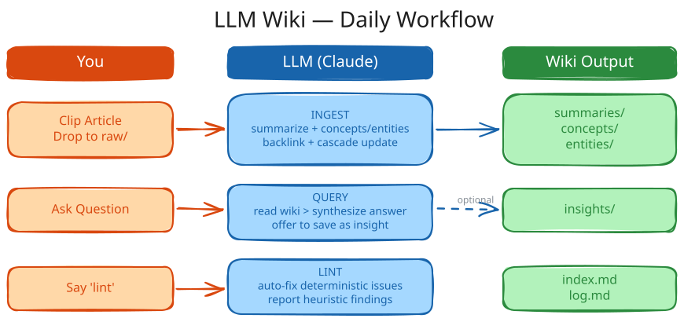

# llm-wiki

<p align="center">
  <br />
  <sub>基于 OKF 的个人知识库，与你共同成长</sub>
</p>

一个与你共同成长的 OKF 原生知识库。灵感来自 [Karpathy 的 LLM Wiki](https://gist.github.com/karpathy/442a6bf555914893e9891c11519de94f)。**bundle 就是 wiki**——没有独立的"导出"步骤。

[English](README.md)

本仓库包含两部分：

| 组件 | 路径 | 用途 |
|------|------|---------|
| **Skill** | `skills/llm-wiki/` | Agent 技能（Claude Code / Cursor / Copilot）— INIT、INGEST、QUERY、UPDATE、LINT |
| **CLI** | `lwiki/` | Python 命令行工具 — 初始化 OKF bundle，跟踪 `raw/` 变更，校验，从旧版迁移 |

## 快速开始

```bash
# 1. 前置条件
uv --version || curl -LsSf https://astral.sh/uv/install.sh | sh

# 2. 安装 CLI
uv tool install https://github.com/hsuanguo/llm-wiki.git

# 3. 创建一个新的 bundle
lwiki init ~/wikis/greek-history --domain "Greek history" --sources "articles, papers"

# 4. 在浏览器中浏览 / 编辑
lwiki serve --root ~/wikis
# 访问 http://127.0.0.1:8765

# 5. 校验 OKF 一致性
cd ~/wikis/greek-history && lwiki validate
```

## Bundle 结构

`lwiki init` 直接搭建一个 OKF bundle——bundle 就是 wiki：

```
my-wiki/
├── index.md          # 声明 okf_version: "0.2"
├── log.md            # 仅追加的操作日志
├── overview.md       # 顶层概念（OKF frontmatter）
├── AGENTS.md         # 本地约定
├── CLAUDE.md         # 简短存根：@AGENTS.md，供 Claude Code 读取
├── README.md         # 指引文档
├── summaries/        # 来源摘要
├── concepts/         # 概念页
├── entities/         # 实体页（人物、工具、组织、产品）
├── insights/         # 综合分析与跨页分析
└── raw/              # 不可变来源，由 raw/files.log 跟踪
```

没有 `wiki/` 包装层。bundle 就是 wiki。

## OKF Frontmatter

仅 `type` 是强制要求的，其他字段是建议性的。

| 层级 | 字段 |
|------|------|
| **必填** | `type`（`summary`、`concept`、`entity`、`insight`、`overview`、`attested-computation` 之一） |
| **建议** | `title`、`description`、`tags`、`generated: { by, at }`、`status` |
| **可选** | `resource`（规范 URI）、`sources`（可信度条目列表）、`verified`（审计记录）、`usage_window` |

OKF 的来源追溯取代了旧版 wiki 内部的 `updated:`、`sources: [paths]` 和 `cited:` 字段。

## 使用方法

日常使用中你面对的是 AI agent，而不是 CLI。先把 skill 复制到 agent 的技能目录：

```bash
cp -r skills/llm-wiki /path/to/project/.claude/skills/
```

`.claude/skills/` 被大多数 AI agent 支持（Claude Code、OpenCode、Cursor 等）。如果你的 agent 使用别的路径，把它移过去即可。

<p align="center">
  <br />
</p>

### 1. 创建新 Wiki（INIT）

告诉 Agent：

```
在 ~/wikis/greek-history 初始化一个关于希腊历史的 wiki
```

Agent 会：
- 运行 `lwiki init` 搭建 OKF bundle（见 [Bundle 结构](#bundle-结构)）
- 生成 `AGENTS.md`（领域模式定义）、`CLAUDE.md`、`README.md`，以及初始的 `index.md` / `log.md` / `overview.md`
- 创建空的 `raw/`、`summaries/`、`concepts/`、`entities/`、`insights/` 目录和初始的 `raw/files.log`

### 2. 添加资料来源（INGEST）

#### 方式 A：文件

将源文件（PDF、Markdown 等）移入 `~/wikis/greek-history/raw/`，然后告诉 Agent：

```
收录 raw/ 中的所有新资料
```

#### 方式 B：直接粘贴内容

```
将以下内容添加到 wiki：
<粘贴文章文本或 URL>
```

#### 收录过程

Agent 会：
1. 完整阅读每个资料来源
2. 在 `summaries/`、`concepts/`、`entities/` 中创建或更新页面
3. 执行反向链接审查 — 在现有页面间添加 markdown 链接
4. 扫描整个 bundle，查找受新信息影响的页面（级联更新）
5. 更新 `index.md`、`overview.md` 和 `log.md`
6. 通过 `lwiki raw sync` 同步 `raw/files.log`

**注意：** Agent 会自主执行全部流程，只在遇到真正模糊的情况（事实不明、来源冲突且无法自行判断）时才会向你确认。

### 3. 提问（QUERY）

```
关于伯罗奔尼撒战争我们了解多少？
```

```
对比所有资料中雅典和斯巴达的军事策略
```

```
关于迈锡尼文明的衰落，还有哪些未解之谜？
```

Agent 严格基于 bundle 内容回答，并用 markdown 链接引用页面。回答后，它可能会：
- **主动提议保存**分析结果为 insight 页面（如果回答有独立价值）
- **报告问题** — 发现现有页面中的过时信息或矛盾，并询问是否需要修复

### 4. 更新页面（UPDATE）

#### 用户触发（你主动要求修改）

```
更新 concepts/democracy.md — 最新资料说 X
```

```
修复 concepts/oligarchy.md 和 concepts/democracy.md 之间的矛盾
```

Agent 会为每个页面展示差异对比，等待你确认后再写入。

#### Agent 触发（收录过程中自动更新）

当新资料影响已有页面时，如果改动明确，Agent 会自动更新。只有在不确定或涉及含义变更时才会征询你的意见。

### 5. 健康检查（LINT）

```
检查 wiki
```

Agent 会先运行 `lwiki validate` 做 OKF 一致性检查，然后排查：

| 类别 | 自动修复？ | 示例 |
|------|-----------|------|
| **确定性问题** | 是 | 一致性错误、残留的 `[[wikilinks]]`、失效的 `sources:` 路径、索引不一致 |
| **启发性问题** | 否 — 仅报告 | 矛盾、过时声明、孤立页面、缺失交叉引用、过时 insight |

检查报告写入 `insights/lint-<date>.md`，并为启发性问题提供修复建议。

### 6. 检查新资料（漂移检测）

```
raw/ 里有新文件吗？
```

或直接运行：

```bash
lwiki raw status    # 仅报告
lwiki raw sync      # 更新 files.log
```

## 日常工作流

| 你做的 | AI 做的 |
|--------|---------|
| 把源文件丢进 `raw/` | 摄取、摘要、交叉引用 |
| 提问 | 从 bundle 回答；用 markdown 链接引用；可选保存为 insight |
| 说 "lint" | 一致性检查 + 启发式健康报告 |
| 在浏览器中浏览 | `lwiki serve` |
| 迁移旧的 Obsidian 风格 wiki | `lwiki migrate <old> --out <new>` |

## 从旧版 wiki 迁移（0.1.x → 2.0）

如果你还在使用带 `wiki/` 包装层和 `[[wikilinks]]` 的旧版 wiki：

```bash
lwiki migrate ~/old-wiki --out ~/new-bundle
# 源 wiki 保持原样；bundle 输出到新位置
# 所有 frontmatter 迁移到 OKF；[[wikilinks]] 被改写为 markdown 链接
```

迁移完成后，用 `lwiki validate ~/new-bundle` 确认 OKF 一致性。

## CLI 命令速查

| 命令 | 用途 |
|---------|---------|
| `lwiki init <dir> --domain "..."` | 搭建 OKF bundle |
| `lwiki structure` | 打印标准 bundle 结构 |
| `lwiki validate <dir>` | 校验 OKF 一致性 |
| `lwiki serve --root <parent>` | Web UI，浏览 `<parent>` 下所有 bundle |
| `lwiki raw sync` / `lwiki raw status` | 跟踪 `raw/files.log` |
| `lwiki migrate <old> --out <new>` | 从旧 wiki 转换为 OKF bundle |
| `lwiki export okf <bundle>` | 校验一致性（`lwiki validate` 的别名） |

## 许可证

[MIT](LICENSE)